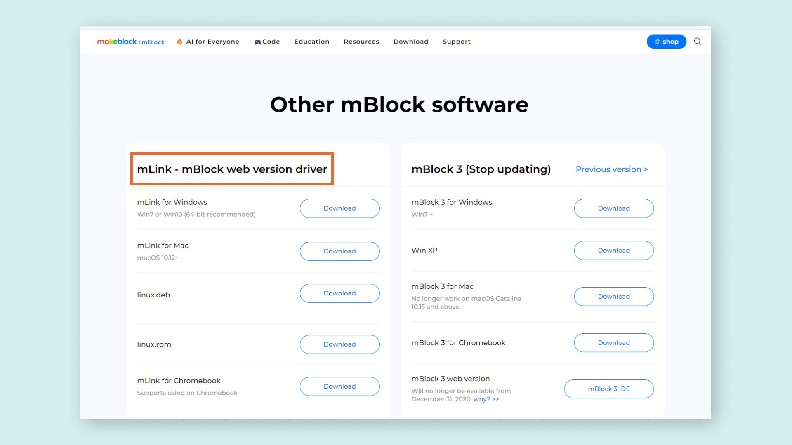
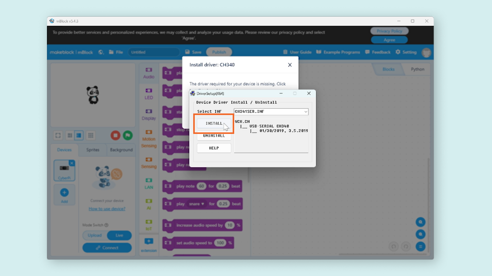
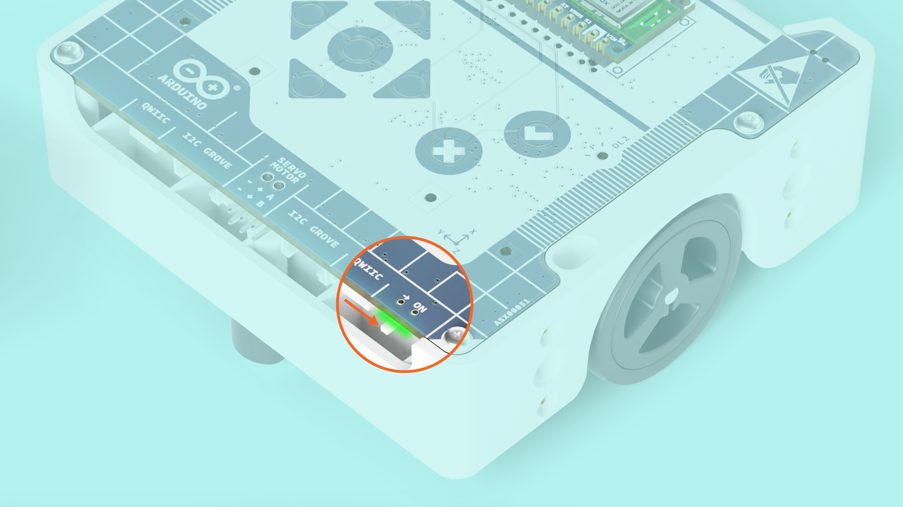
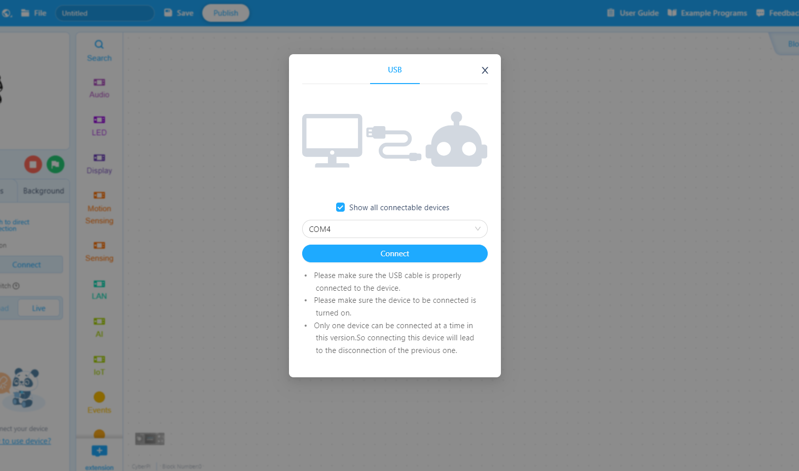
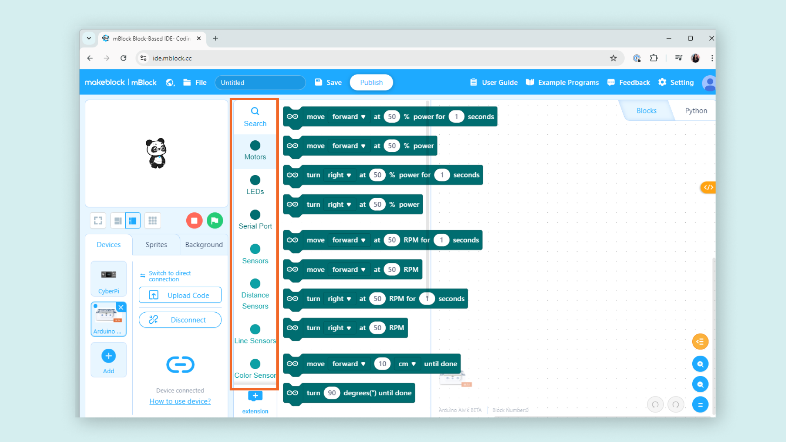
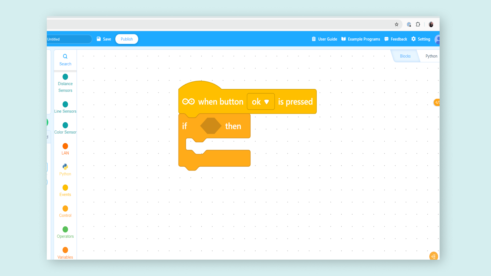
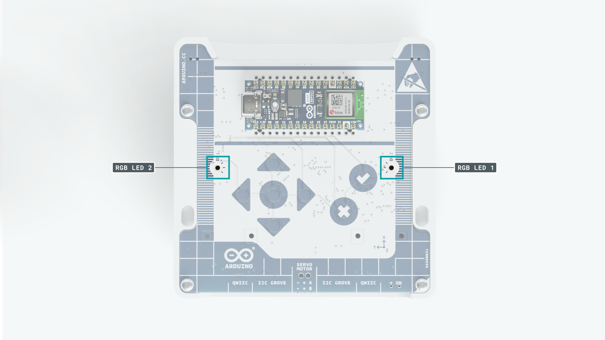
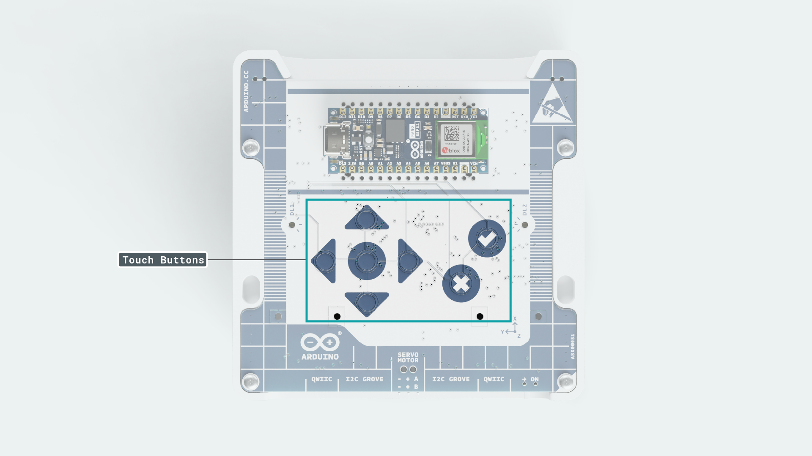

Welcome to your first steps with Alvik, your companion for exploring robotics and programming. In this guide, we'll walk you through setting up your Alvik and starting your journey with block based language.

## What’s Included in the Box 

When unboxing Alvik, you should find the following items:

- Alvik robot
- USB-C® cable (located under the cardboard tray)

## Update Firmware with Alvik Updater

Updating the firmware on your Alvik ensures it has the latest features, bug fixes, and performance improvements. Regular updates help maintain compatibility with the mBlock software and ensure optimal performance of your robot.

1. Visit https://alvikupdate.arduino.cc.
2. Connect Alvik to your computer.
3. Turn ON your Alvik.
4. Click the "Connect" button.
5. **A pop-up window will appear** prompting you to select the COM port. Choose the correct port and confirm.
6. Once connected, click the "Update" button and wait for the process to complete.

## Preparing Your Environment

During the installation process, you may **need to install additional drivers**, that require access to the **administrator login password** to your OS.

### Supported Systems

You can use a computer with different operating systems like:

* Windows
* Mac, 
* Chromebook, 
* Linux. 

***Alvik is not yet supported by mBlock mobile app for Android or IOS devices.***

### Online Coding

For a quick start, you can use the *mBlock web version*. Scroll down on the [download page](https://mblock.cc/pages/downloads) to download the correct **mLink driver** for your **operating system**.

After downloading, install the **drivers**. This small software helps your computer communicate with the robot. When prompted, simply click "INSTALL."

Once mLink is installed, open it and connect to <a href="https://ide.mblock.cc">**ide.mblock.cc**</a> using a web browser (Google Chrome is recommended). From now on, whenever you want to code Alvik, open the mLink application and go to the webpage mentioned above.

### Offline Coding

Please [download the software](https://mblock.cc/pages/downloads), then double-click the installer file and follow the instructions to complete the installation.

If you're using a *Windows* or *Mac* computer, scroll down the page and click the appropriate button. For *Chromebook* or *Linux* users, the process is slightly different.

### Windows

To install mBlock on Windows:

1. Click the "Download for Windows" button, wait for the download to finish, and find the file in your Downloads folder.

​	

2. Double-click the downloaded file and click "YES" when prompted. Follow the on-screen instructions to complete the installation.

3. Install the **drivers**: a window will appear asking you to click "INSTALL."

	
The driver installation window may occasionally open in the background. If this happens, look for the computer icon in your taskbar and click it to proceed. 

If you encounter an installation error, click 'UNINSTALL' and then 'INSTALL' again. Once the drivers are installed, close the driver window manually by clicking the 'X'. Afterward, complete the mBlock installation.

### MacOS

To install mBlock on macOS:

1. Click on the "Download for Mac" button on the [Download page](https://mblock.cc/pages/downloads), wait for the download to finish, and find the file in your Downloads folder.
2. Double-click the downloaded file to mount the `.dmg` file. Then, drag the Panda icon to the Applications folder.

	

3. Open the Applications folder, locate the mBlock app, and open it. The first time you open the software, right-click (or Control-click) on the app and select "Open" from the dropdown menu.

### Chromebook or Linux

If you're using a **Chromebook** ([read the full guide here](https://support.makeblock.com/hc/en-us/articles/19412317319191-Device-Connection-Guide-for-Chromebook-Latest-Version)) or a **Linux** machine, the installation process is different because there is no installable version of the software available. Instead, you'll use the online version of mBlock, which requires a special driver to connect to the robot.

Here you can find the "mLink - mBlock web version driver" and download the appropriate file for your operating system.

## Connect the Robot to mBlock

To program Alvik, start by opening the mBlock software if you haven’t already. Once the software is open, follow these steps to connect:

**1.** Locate the robot's **on/off switch** and slide it to the **OFF** position.

***To ensure a proper connection and protect the robot's battery, always turn off the robot before connecting it to your computer; it may not appear if left on.***

**2.**  <a href="https://ide.mblock.cc">Open mBlock</a>. In the `Device` section, add Alvik as a programmable board by clicking the `+ Add` button, then selecting Alvik from the robot list.

**3.** **Connect the programming cable** to your computer and the Arduino Nano ESP32.

**4.** Locate the robot's **on/off switch** and slide it to the **ON** position.

**5.** Establish the connection to **mBlock** clicking on the **Connect** button.

**6.** Click the **Connect** button in the pop-up window.

In the connect window, select the **Serial Port**, in Windows you might see something like COM4 (or another number), while on other operating systems, it could be something like `/dev/tty.[yourSerialPortName]`. mBlock typically detects the correct port automatically, but if you encounter any issues, make sure the selected port is the right one.

**7.** You are **ready** to work!

## Blocks 

Explore mBlock to start programming your Alvik. In the center of the interface, you’ll find a list of visual blocks, each representing a command that Alvik can execute. These blocks are grouped **into color-coded categories based on the type of action** they perform.

When you're creating a sequence of commands for Alvik you **always need to start by stating the initial event**:

* `When Alvik starts`  - the code will be executed the moment you turn ON Alvik.

or

* `When button [] is pressed` - the code will be executed the moment you press the designated button.

### Blocks Parameters

Every parameter inside the **rectangle area**, for example the number `5` or the `cancel ▼` element in the dropdown menu can be edited, to give Alvik a different behavior.

Some blocks, for example in the`Control` section, have an **hexagonal** tile `⬣` parameter, where you can drag and drop in an entire block, allowing you to nest commands like for `if <   > then {   }`.

## Blink Example

Alvik comes with two built-in **RGB LEDs**, located on top of the robot.

On the top of Alvik you can also find **8 buttons**, that let you operate the robot.

The goal of **our first program** is to make the LEDs flash when you press a button on Alvik:

1. Navigate to the `Events` folder and drag the command `When button [ok] is pressed` to the coding area on the right. 

2. Next, go to the `LEDs` folder and drag `set [left] LED color to [RED] for (1) seconds` into the coding area, connecting it to the previous command.

3. You need to upload the code to the robot. **Remember to turn ON the robot when you are transferring the code.** Click the `Upload Code` button in the left side of the interface, and wait for the file transfer. 

Now you’ve created your first program: Alvik will turn on the left LED for one second when the OK `✔` button is pressed.

 

### ToF Sensor Example

In this second example Alvik will try to keep a constant distance from an object, moving back and forward accordingly.

<video width="100%" loop autoplay>
<source src="assets/tof-video.mp4" type="video/mp4" />
</video>

Navigate to `Control` commands folder.

Inside a loop block called `forever` , use the command `if <   > then {   } else {   }` 

Alvik needs time to read the distance sensor therefore we need to avoid executing the loop block `forever` too fast. To fix this, add a **small delay** (about 0.1 seconds) with the block `wait ( )`. This won’t change much in behavior but will give Alvik **enough time to read the sensor**.

We'll also use two other types of blocks: the `Motor` blocks contain all the actions needed to control Alvik's wheels, while the `Distance Sensors` folder holds the blocks for controlling the Time of Flight sensor.

### Next Steps

*  For more in depth block-based guided projects with STEAM topics [visit the course page](https://courses.arduino.cc/block-based-coding-robotics).
*  If you want to learn more about how Alvik is built or which functions you can use to program it, visit the documentation in the [Docs space for Alvik](https://docs.arduino.cc/hardware/alvik/) and follow the respective [Alvik's User Manual](https://docs.arduino.cc/hardware/alvik/user-manual) to know more about how to build incredible projects with your robot!
* If you want to follow step-by-step guided projects following an educational approach to learn MicroPython and robotics topics with Alvik, follow the [Explore Robotics in MicroPython](https://courses.arduino.cc/explore-robotics-micropython/) course.
