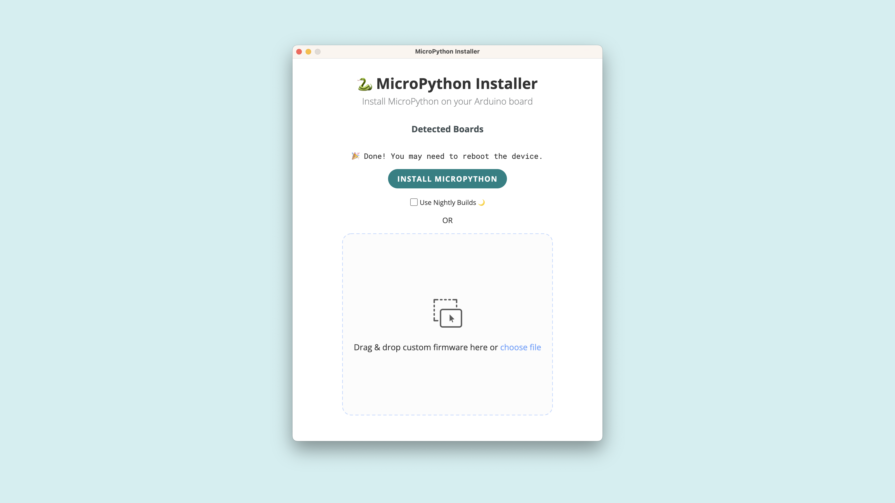

# Installing MicroPython

In this article, we'll walk you through the process of installing MicroPython on your Arduino board. By the end of this guide, you (and your board) will be ready to write and run your first MicroPython script. Let's get started!

## Requirements

Before you begin, make sure you have the following:

### Supported Arduino Boards
MicroPython is officially supported on several Arduino boards. Here’s a list of compatible boards:

- [Portenta C33](https://store.arduino.cc/products/portenta-c33)
- [Arduino GIGA R1 WiFi](https://store.arduino.cc/products/arduino-giga-r1-wifi)
- [Portenta H7](https://store.arduino.cc/products/portenta-h7)
- [Portenta H7 Lite](https://store.arduino.cc/products/portenta-h7-lite)
- [Portenta H7 Lite Connected](https://store.arduino.cc/products/portenta-h7-lite-connected)
- [Opta](https://store.arduino.cc/products/opta)
- [Opta Wifi](https://store.arduino.cc/products/opta-wifi)
- [Opta RS485](https://store.arduino.cc/products/opta-rs485)
- [Arduino Nano RP2040 Connect](https://store.arduino.cc/products/arduino-nano-rp2040-connect)
- [Nicla Vision](https://store.arduino.cc/products/nicla-vision)
- [Arduino Nano 33 BLE](https://store.arduino.cc/products/arduino-nano-33-ble)
- [Arduino Nano 33 BLE Rev2](https://store.arduino.cc/products/arduino-nano-33-ble-rev2)
- [Arduino Nano 33 BLE Sense](https://store.arduino.cc/products/arduino-nano-33-ble-sense)
- [Arduino Nano 33 BLE Sense Rev2](https://store.arduino.cc/products/arduino-nano-33-ble-sense-rev2)
- [Arduino Nano ESP32](https://store.arduino.cc/products/arduino-nano-esp32)

### Software Requirements
- **Arduino Labs for Micropython**: Ensure you have the [latest version](https://labs.arduino.cc/en/labs/micropython) of the IDE. (Optional)
- **MicroPython Firmware Installer**: [This installer](https://labs.arduino.cc/en/labs/micropython-installer) is needed to upload the MicroPython firmware onto your Arduino board. You can download it from the official Arduino website under the MicroPython section.

## How to setup your board

1. If you haven’t already, download the [Micropython Firmware Installer](https://labs.arduino.cc/en/labs/micropython-installer) and launch it.
2. Plug your board, it should be recognized by the installer.

3. Press **INSTALL MICROPYTHON**. A loading animation will appear.

Once the firmware is installed a "Installation successful" message will appear. At this point you can safely close the installer as your board is now ready for tinkering!

### IDE setup

#### Offline IDE

After downloading the [latest version](https://labs.arduino.cc/en/labs/micropython) of the IDE you can use it for the first time by:
- Unpack the compressed folder you downloaded.
- Execute "Arduino Lab for MicroPython.exe"

#### Online IDE

Alternatively, you can use the IDE without installing it by using the online version available [here](https://lab-micropython.arduino.cc/).

#### Connecting Board and IDE

1. Plug your Arduino board into your computer using a USB cable.
2. Press the connection button on the top left corner of the window. This will look like a plug and socket as in this image:
TODO: ADD IMAGE OF CONNECTION
3. Select the COM port where your board is connected.

You are now ready to upload your first sketch.
TODO: A 4 step screenshot to explain the processimage

## Troubleshooting

If you run into any issues during installation, here are some common problems and solutions:

### 1. **Board Not Detected**
- **Solution**: Ensure that your board is properly connected and the correct USB drivers are installed. Try using a different USB cable or port.

### 2. **Unable to Flash Firmware**
- **Solution**: Double-check that the MicroPython Firmware Installer was able to burn the firmware and that your board is compatible(it will not show up on the installer if it is not). Also, verify that no other software is using the serial port.

By following these steps, you should be able to successfully install MicroPython on your Arduino board and run your first script. Stay tuned for more tutorials to help you get the most out of MicroPython!
For information on how to uploadyour first sketch please check . TODO: We need to add here the guide for first sketch once it is linkable